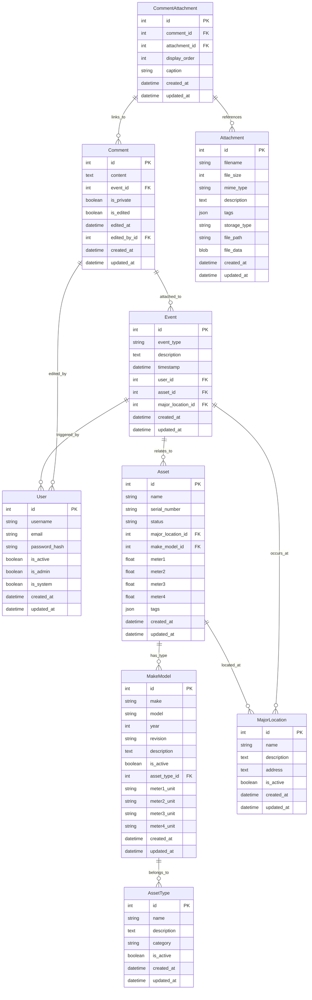

# Core Data Model

## Entity Relationship Diagram

## Key Relationships

### Core Asset Relationships
- **Asset** → **MajorLocation**: Each asset is located at a major location
- **Asset** → **MakeModel**: Each asset has a specific make/model
- **MakeModel** → **AssetType**: Each make/model belongs to an asset type category

### Event System
- **Event** → **User**: Events are triggered by users
- **Event** → **Asset**: Events relate to specific assets
- **Event** → **MajorLocation**: Events occur at specific locations

### Communication System
- **Comment** → **Event**: Comments are attached to events
- **Comment** → **User**: Comments can be edited by users
- **CommentAttachment** → **Comment**: Attachments are linked to comments
- **CommentAttachment** → **Attachment**: Junction table for comment-attachment relationships

## Notes
- All entities inherit audit fields (`created_at`, `updated_at`) from `UserCreatedBase`
- The `created_by` and `updated_by` relationships are excluded as requested
- Foreign keys are clearly marked with (FK) suffix
- Primary keys are marked with (PK) suffix 