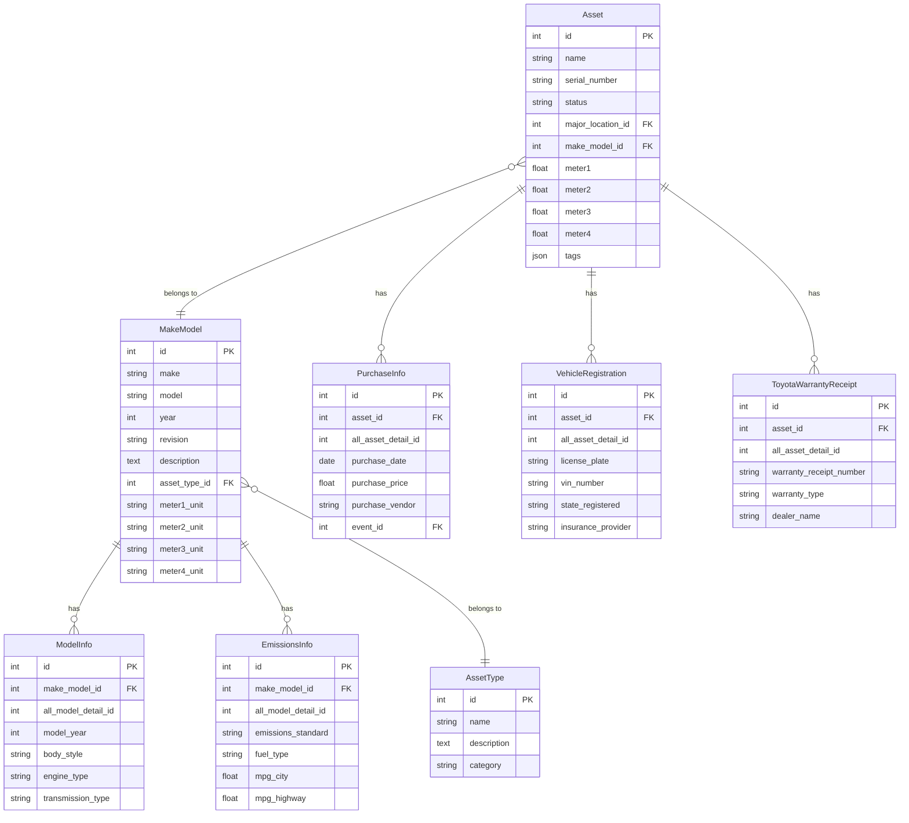

# Asset Management System - Data Model Documentation

## Overview

The Asset Management System implements a sophisticated hierarchical data model designed for flexibility, scalability, and maintainability. The system uses a modular approach with clear separation between core entities and extensible detail table systems.

## Core Architecture

### Hierarchical Relationship Structure

The system follows a three-tier hierarchy:

1. **Asset** - Individual physical assets with specific properties
2. **MakeModel** - Manufacturer and model specifications 
3. **AssetType** - Top-level categorization (Vehicle, Equipment, Tool, etc.)

This design ensures data consistency and simplifies relationship management across the system.

## Main Entity Classes

### Asset Class
The Asset class represents individual physical assets in the system.

**Key Properties:**
- `name` - Human-readable asset name
- `serial_number` - Unique identifier for the asset
- `status` - Current operational status (Active, Inactive, etc.)
- `major_location_id` - Foreign key to location
- `make_model_id` - Foreign key to make/model specifications
- `meter1` through `meter4` - Flexible meter readings with units inherited from make/model
- `tags` - JSON field for flexible categorization

**Relationships:**
- Links to MakeModel through `make_model_id`
- Links to MajorLocation through `major_location_id`
- Has many Events through asset_id
- Automatically creates detail table rows on creation

### MakeModel Class
The MakeModel class represents manufacturer and model specifications that can be shared across multiple assets.

**Key Properties:**
- `make` - Manufacturer name (Toyota, Ford, etc.)
- `model` - Model name (Corolla, F-150, etc.)
- `year` - Model year
- `revision` - Model revision or variant
- `description` - Detailed description
- `asset_type_id` - Foreign key to asset type
- `meter1_unit` through `meter4_unit` - Units for meter readings

**Relationships:**
- Links to AssetType through `asset_type_id`
- Has many Assets through make_model_id
- Automatically creates detail table rows on creation

## Detail Table System

The system implements two parallel detail table systems that extend the core entities with specialized information.

### Asset Detail Tables

Asset detail tables store asset-specific information and inherit from `AssetDetailVirtual`.

**Base Class: AssetDetailVirtual**
- Abstract base class providing common functionality
- `asset_id` - Foreign key to Asset
- `all_asset_detail_id` - Global sequence ID across all asset detail tables
- Inherits from UserCreatedBase for audit trails

**Concrete Detail Tables:**

1. **PurchaseInfo**
   - Purchase date, price, vendor information
   - Warranty start/end dates
   - Purchase order numbers and notes
   - Links to Event through event_id

2. **VehicleRegistration**
   - License plate and registration information
   - VIN number and state registration
   - Insurance provider and policy details
   - Registration and insurance expiry tracking

3. **ToyotaWarrantyReceipt**
   - Toyota-specific warranty information
   - Warranty receipt numbers and types
   - Dealer contact information
   - Service history and warranty claims

### Model Detail Tables

Model detail tables store make/model-specific information and inherit from `ModelDetailVirtual`.

**Base Class: ModelDetailVirtual**
- Abstract base class providing common functionality
- `make_model_id` - Foreign key to MakeModel
- `all_model_detail_id` - Global sequence ID across all model detail tables
- Inherits from UserCreatedBase for audit trails

**Concrete Detail Tables:**

1. **ModelInfo**
   - General model specifications
   - Body style, engine type, transmission
   - Seating capacity, cargo capacity, towing capacity
   - Technical specifications and manufacturer website

2. **EmissionsInfo**
   - Emissions standards and ratings
   - Fuel type and efficiency (MPG)
   - CO2 emissions data
   - Emissions test dates and certifications

## Union Query Services

The system provides union query services that allow querying across all detail tables of the same type.

### AssetDetailsUnionService
- Queries across all asset detail tables (PurchaseInfo, VehicleRegistration, ToyotaWarrantyReceipt)
- Provides unified search, filtering, and reporting capabilities
- Returns results with metadata about source tables

### ModelDetailsUnionService
- Queries across all model detail tables (ModelInfo, EmissionsInfo)
- Provides unified search, filtering, and reporting capabilities
- Returns results with metadata about source tables

## Global ID Management

The system uses global ID managers to maintain unique sequences across detail tables.

### AssetDetailIDManager
- Manages `all_asset_detail_id` sequence across all asset detail tables
- Ensures unique identification across the entire asset detail system

### ModelDetailIDManager
- Manages `all_model_detail_id` sequence across all model detail tables
- Ensures unique identification across the entire model detail system

## Automatic Detail Table Creation

The system automatically creates detail table rows when new assets or models are created.

### Asset Creation Process
1. Asset is created with basic information
2. System determines asset type through make/model relationship
3. Detail table rows are created based on asset type and model type
4. Event is automatically created for asset creation

### Model Creation Process
1. MakeModel is created with specifications
2. Detail table rows are created based on asset type
3. Event is automatically created for model creation

## Data Model Diagram

## Key Design Principles

### 1. Separation of Concerns
- Core entities handle basic relationships and properties
- Detail tables handle specialized information
- Union services provide unified access patterns

### 2. Extensibility
- New detail tables can be added without modifying core entities
- Global ID management ensures unique identification
- Template system supports automatic detail table creation

### 3. Data Consistency
- Hierarchical relationships prevent data inconsistencies
- Foreign key constraints maintain referential integrity
- Audit trails track all changes through UserCreatedBase

### 4. Performance Optimization
- Indexed foreign keys for efficient queries
- Union services provide optimized cross-table queries
- Automatic detail creation reduces manual data entry

### 5. Maintainability
- Clear inheritance hierarchies
- Consistent naming conventions
- Modular design supports independent development

## Benefits of This Architecture

1. **Scalability**: New asset types and detail information can be added without schema changes
2. **Flexibility**: Detail tables can be customized for specific asset types
3. **Consistency**: Hierarchical relationships ensure data integrity
4. **Performance**: Optimized queries through union services and proper indexing
5. **Maintainability**: Clear separation of concerns and modular design
6. **Auditability**: Complete audit trails for all data changes
7. **Automation**: Automatic detail table creation reduces manual work
8. **Reporting**: Union services enable comprehensive reporting across detail tables
