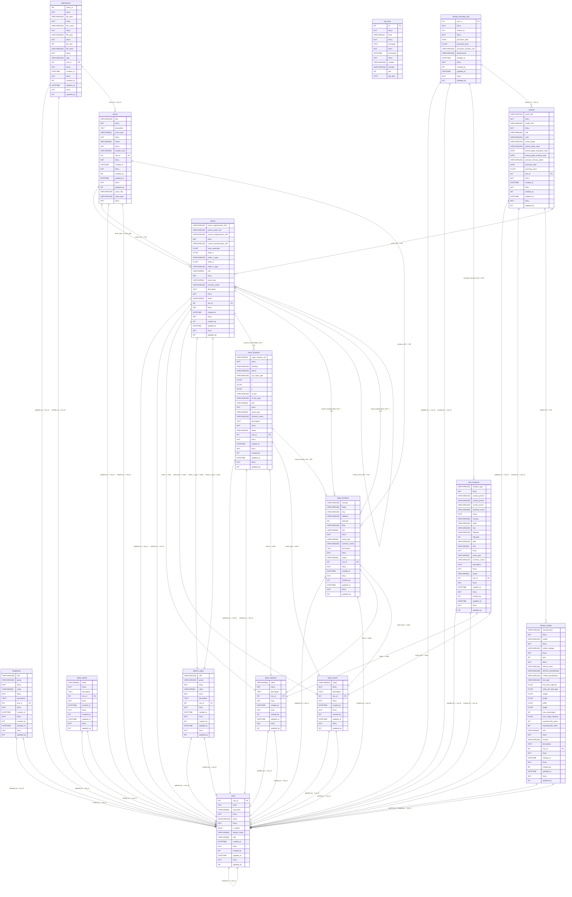

# Database Schema - Complete Mermaid Diagram

```mermaid
erDiagram
    assets {
        VARCHAR(100) home_majorlocation_UID
        VARCHAR(100) parent_asset_UID
        VARCHAR(100) current_majorlocation_UID NOT NULL
        VARCHAR(100) current_minorlocation_UID
        FLOAT hours_operated
        FLOAT meter_1
        VARCHAR(100) meter_1_type
        FLOAT meter_2
        VARCHAR(100) meter_2_type
        VARCHAR(50) UID NOT NULL
        VARCHAR(50) asset_type
        VARCHAR(100) common_name
        TEXT description NOT NULL
        VARCHAR(50) status
        INT row_id PK NOT NULL
        DATETIME created_at NOT NULL
        INT created_by
        DATETIME updated_at NOT NULL
        INT updated_by
    }
    attachments {
        INT event_id NOT NULL
        VARCHAR(100) file_path NOT NULL
        VARCHAR(100) file_name NOT NULL
        VARCHAR(100) file_type NOT NULL
        INT file_size
        VARCHAR(100) file_hash NOT NULL
        VARCHAR(100) tags
        INT row_id PK NOT NULL
        DATETIME created_at NOT NULL
        INT created_by
        DATETIME updated_at NOT NULL
        INT updated_by
    }
    dropdowns {
        VARCHAR(100) UID
        VARCHAR(100) group NOT NULL
        VARCHAR(64) value NOT NULL
        TEXT description
        INT row_id PK NOT NULL
        DATETIME created_at NOT NULL
        INT created_by
        DATETIME updated_at NOT NULL
        INT updated_by
    }
    events {
        VARCHAR(255) title NOT NULL
        TEXT description
        VARCHAR(64) event_type NOT NULL
        VARCHAR(50) status NOT NULL
        VARCHAR(50) location_UID
        INT row_id PK NOT NULL
        DATETIME created_at NOT NULL
        INT created_by
        DATETIME updated_at NOT NULL
        INT updated_by
        VARCHAR(100) asset_UID
        VARCHAR(100) asset_type NOT NULL
    }
    generic_types {
        VARCHAR(100) UID
        VARCHAR(100) group NOT NULL
        VARCHAR(64) value NOT NULL
        TEXT description
        INT row_id PK NOT NULL
        DATETIME created_at NOT NULL
        INT created_by
        DATETIME updated_at NOT NULL
        INT updated_by
    }
    log_entry {
        INT id PK NOT NULL
        VARCHAR(10) level NOT NULL
        TEXT message NOT NULL
        DATETIME timestamp NOT NULL
        VARCHAR(100) module
        VARCHAR(100) function
        INT line
        TEXT log_data
    }
    major_locations {
        VARCHAR(100) Country
        VARCHAR(100) State
        VARCHAR(100) City
        VARCHAR(100) Address
        INT ZipCode
        VARCHAR(100) Misc
        VARCHAR(50) UID NOT NULL
        VARCHAR(50) asset_type
        VARCHAR(100) common_name
        TEXT description NOT NULL
        VARCHAR(50) status
        INT row_id PK NOT NULL
        DATETIME created_at NOT NULL
        INT created_by
        DATETIME updated_at NOT NULL
        INT updated_by
    }
    minor_locations {
        VARCHAR(50) major_location_uid NOT NULL
        VARCHAR(100) Building
        VARCHAR(100) Room
        VARCHAR(100) xyz_orgin_type
        FLOAT x
        FLOAT y
        FLOAT z
        VARCHAR(100) ml_bin
        VARCHAR(100) ml_bin_type
        VARCHAR(50) UID NOT NULL
        VARCHAR(50) asset_type
        VARCHAR(100) common_name
        TEXT description NOT NULL
        VARCHAR(50) status
        INT row_id PK NOT NULL
        DATETIME created_at NOT NULL
        INT created_by
        DATETIME updated_at NOT NULL
        INT updated_by
    }
    misc_locations {
        VARCHAR(100) location_type NOT NULL
        VARCHAR(100) contact_person
        VARCHAR(100) contact_phone
        VARCHAR(100) contact_email
        VARCHAR(200) business_hours
        TEXT notes
        VARCHAR(100) Country
        VARCHAR(100) State
        VARCHAR(100) City
        VARCHAR(100) Address
        INT ZipCode
        VARCHAR(100) Misc
        VARCHAR(50) UID NOT NULL
        VARCHAR(50) asset_type
        VARCHAR(100) common_name
        TEXT description NOT NULL
        VARCHAR(50) status
        INT row_id PK NOT NULL
        DATETIME created_at NOT NULL
        INT created_by
        DATETIME updated_at NOT NULL
        INT updated_by
    }
    types_assets {
        VARCHAR(64) value NOT NULL
        TEXT description
        INT row_id PK NOT NULL
        DATETIME created_at NOT NULL
        INT created_by
        DATETIME updated_at NOT NULL
        INT updated_by
    }
    types_events {
        VARCHAR(64) value NOT NULL
        TEXT description
        INT row_id PK NOT NULL
        DATETIME created_at NOT NULL
        INT created_by
        DATETIME updated_at NOT NULL
        INT updated_by
    }
    types_statuses {
        VARCHAR(64) value NOT NULL
        TEXT description
        INT row_id PK NOT NULL
        DATETIME created_at NOT NULL
        INT created_by
        DATETIME updated_at NOT NULL
        INT updated_by
    }
    users {
        INT row_id PK NOT NULL
        VARCHAR(64) username NOT NULL
        VARCHAR(128) email NOT NULL
        BOOL is_admin
        VARCHAR(64) display_name
        VARCHAR(64) role
        DATETIME created_at NOT NULL
        INT created_by
        DATETIME updated_at NOT NULL
        INT updated_by
    }
    vehicle_models {
        VARCHAR(100) manufacturer NOT NULL
        VARCHAR(100) model NOT NULL
        VARCHAR(100) model_subtype NOT NULL
        INT year NOT NULL
        VARCHAR(100) vehicle_class
        VARCHAR(100) NHTSA_classification
        VARCHAR(100) CARB_classification
        VARCHAR(100) fuel_type
        FLOAT fuel_tank_capacity
        FLOAT miles_per_fuel_type
        FLOAT weight
        FLOAT length
        FLOAT width
        FLOAT height
        INT max_passengers
        FLOAT max_cargo_capacity
        INT expected_life_years
        INT expected_life_miles
        VARCHAR(50) UID NOT NULL
        VARCHAR(100) revision
        TEXT description
        INT row_id PK NOT NULL
        DATETIME created_at NOT NULL
        INT created_by
        DATETIME updated_at NOT NULL
        INT updated_by
    }
    vehicle_purchase_info {
        INT row_id PK NOT NULL
        INT vehicle_id NOT NULL
        DATE purchase_date
        FLOAT purchase_price
        VARCHAR(100) purchase_location_UID
        VARCHAR(100) attachments
        DATETIME created_at NOT NULL
        INT created_by
        DATETIME updated_at NOT NULL
        INT updated_by
    }
    vehicles {
        VARCHAR(100) asset_UID NOT NULL
        VARCHAR(100) model_UID NOT NULL
        VARCHAR(100) VIN
        VARCHAR(100) color
        VARCHAR(100) license_plate
        VARCHAR(100) license_plate_state
        DATE license_plate_expiration_date
        DATE license_plate_renewal_date
        VARCHAR(100) previous_license_plates
        DATE purchase_date
        FLOAT purchase_price
        INT row_id PK NOT NULL
        DATETIME created_at NOT NULL
        INT created_by
        DATETIME updated_at NOT NULL
        INT updated_by
    }

    %% Relationships
    assets ||--|| users : "updated_by -> row_id"
    assets ||--|| users : "created_by -> row_id"
    assets ||--|| types_statuses : "status -> value"
    assets ||--|| types_assets : "asset_type -> value"
    assets ||--|| generic_types : "meter_2_type -> value"
    assets ||--|| generic_types : "meter_1_type -> value"
    assets ||--o{ minor_locations : "current_minorlocation_UID -> UID"
    assets ||--o{ major_locations : "current_majorlocation_UID -> UID"
    assets ||--o{ assets : "parent_asset_UID -> UID"
    assets ||--o{ major_locations : "home_majorlocation_UID -> UID"
    attachments ||--|| users : "updated_by -> row_id"
    attachments ||--|| users : "created_by -> row_id"
    attachments ||--o{ events : "event_id -> row_id"
    dropdowns ||--|| users : "updated_by -> row_id"
    dropdowns ||--|| users : "created_by -> row_id"
    events ||--|| assets : "asset_type -> asset_type"
    events ||--o{ assets : "asset_UID -> UID"
    events ||--|| users : "updated_by -> row_id"
    events ||--|| users : "created_by -> row_id"
    events ||--o{ major_locations : "location_UID -> UID"
    generic_types ||--|| users : "updated_by -> row_id"
    generic_types ||--|| users : "created_by -> row_id"
    major_locations ||--|| users : "updated_by -> row_id"
    major_locations ||--|| users : "created_by -> row_id"
    major_locations ||--|| types_statuses : "status -> value"
    major_locations ||--|| types_assets : "asset_type -> value"
    minor_locations ||--|| users : "updated_by -> row_id"
    minor_locations ||--|| users : "created_by -> row_id"
    minor_locations ||--|| types_statuses : "status -> value"
    minor_locations ||--|| types_assets : "asset_type -> value"
    minor_locations ||--|| major_locations : "major_location_uid -> UID"
    misc_locations ||--|| users : "updated_by -> row_id"
    misc_locations ||--|| users : "created_by -> row_id"
    misc_locations ||--|| types_statuses : "status -> value"
    misc_locations ||--|| types_assets : "asset_type -> value"
    types_assets ||--|| users : "updated_by -> row_id"
    types_assets ||--|| users : "created_by -> row_id"
    types_events ||--|| users : "updated_by -> row_id"
    types_events ||--|| users : "created_by -> row_id"
    types_statuses ||--|| users : "updated_by -> row_id"
    types_statuses ||--|| users : "created_by -> row_id"
    users ||--|| users : "updated_by -> row_id"
    users ||--|| users : "created_by -> row_id"
    vehicle_models ||--|| users : "updated_by -> row_id"
    vehicle_models ||--|| users : "created_by -> row_id"
    vehicle_purchase_info ||--|| users : "updated_by -> row_id"
    vehicle_purchase_info ||--|| users : "created_by -> row_id"
    vehicle_purchase_info ||--o{ misc_locations : "purchase_location_UID -> UID"
    vehicle_purchase_info ||--o{ vehicles : "vehicle_id -> row_id"
    vehicles ||--|| users : "updated_by -> row_id"
    vehicles ||--|| users : "created_by -> row_id"
    vehicles ||--o{ vehicle_models : "model_UID -> UID"
    vehicles ||--o{ assets : "asset_UID -> UID"
```
