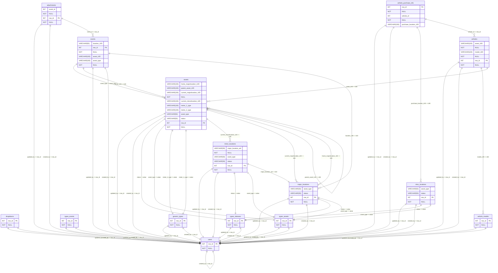

# Database Schema - Relationship Diagram (Foreign Keys Only)

```mermaid
erDiagram
    assets {
        VARCHAR(100) home_majorlocation_UID
        VARCHAR(100) parent_asset_UID
        VARCHAR(100) current_majorlocation_UID NOT NULL
        VARCHAR(100) current_minorlocation_UID
        VARCHAR(100) meter_1_type
        VARCHAR(100) meter_2_type
        VARCHAR(50) asset_type
        VARCHAR(50) status
        INT row_id PK NOT NULL
    }
    attachments {
        INT event_id NOT NULL
        INT row_id PK NOT NULL
    }
    dropdowns {
        INT row_id PK NOT NULL
    }
    events {
        VARCHAR(50) location_UID
        INT row_id PK NOT NULL
        VARCHAR(100) asset_UID
        VARCHAR(100) asset_type NOT NULL
    }
    generic_types {
        INT row_id PK NOT NULL
    }
    major_locations {
        VARCHAR(50) asset_type
        VARCHAR(50) status
        INT row_id PK NOT NULL
    }
    minor_locations {
        VARCHAR(50) major_location_uid NOT NULL
        VARCHAR(50) asset_type
        VARCHAR(50) status
        INT row_id PK NOT NULL
    }
    misc_locations {
        VARCHAR(50) asset_type
        VARCHAR(50) status
        INT row_id PK NOT NULL
    }
    types_assets {
        INT row_id PK NOT NULL
    }
    types_events {
        INT row_id PK NOT NULL
    }
    types_statuses {
        INT row_id PK NOT NULL
    }
    users {
        INT row_id PK NOT NULL
    }
    vehicle_models {
        INT row_id PK NOT NULL
    }
    vehicle_purchase_info {
        INT row_id PK NOT NULL
        INT vehicle_id NOT NULL
        VARCHAR(100) purchase_location_UID
    }
    vehicles {
        VARCHAR(100) asset_UID NOT NULL
        VARCHAR(100) model_UID NOT NULL
        INT row_id PK NOT NULL
    }

    %% Foreign Key Relationships
    assets ||--|| users : "updated_by -> row_id"
    assets ||--|| users : "created_by -> row_id"
    assets ||--|| types_statuses : "status -> value"
    assets ||--|| types_assets : "asset_type -> value"
    assets ||--|| generic_types : "meter_2_type -> value"
    assets ||--|| generic_types : "meter_1_type -> value"
    assets ||--o{ minor_locations : "current_minorlocation_UID -> UID"
    assets ||--o{ major_locations : "current_majorlocation_UID -> UID"
    assets ||--o{ assets : "parent_asset_UID -> UID"
    assets ||--o{ major_locations : "home_majorlocation_UID -> UID"
    attachments ||--|| users : "updated_by -> row_id"
    attachments ||--|| users : "created_by -> row_id"
    attachments ||--o{ events : "event_id -> row_id"
    dropdowns ||--|| users : "updated_by -> row_id"
    dropdowns ||--|| users : "created_by -> row_id"
    events ||--|| assets : "asset_type -> asset_type"
    events ||--o{ assets : "asset_UID -> UID"
    events ||--|| users : "updated_by -> row_id"
    events ||--|| users : "created_by -> row_id"
    events ||--o{ major_locations : "location_UID -> UID"
    generic_types ||--|| users : "updated_by -> row_id"
    generic_types ||--|| users : "created_by -> row_id"
    major_locations ||--|| users : "updated_by -> row_id"
    major_locations ||--|| users : "created_by -> row_id"
    major_locations ||--|| types_statuses : "status -> value"
    major_locations ||--|| types_assets : "asset_type -> value"
    minor_locations ||--|| users : "updated_by -> row_id"
    minor_locations ||--|| users : "created_by -> row_id"
    minor_locations ||--|| types_statuses : "status -> value"
    minor_locations ||--|| types_assets : "asset_type -> value"
    minor_locations ||--|| major_locations : "major_location_uid -> UID"
    misc_locations ||--|| users : "updated_by -> row_id"
    misc_locations ||--|| users : "created_by -> row_id"
    misc_locations ||--|| types_statuses : "status -> value"
    misc_locations ||--|| types_assets : "asset_type -> value"
    types_assets ||--|| users : "updated_by -> row_id"
    types_assets ||--|| users : "created_by -> row_id"
    types_events ||--|| users : "updated_by -> row_id"
    types_events ||--|| users : "created_by -> row_id"
    types_statuses ||--|| users : "updated_by -> row_id"
    types_statuses ||--|| users : "created_by -> row_id"
    users ||--|| users : "updated_by -> row_id"
    users ||--|| users : "created_by -> row_id"
    vehicle_models ||--|| users : "updated_by -> row_id"
    vehicle_models ||--|| users : "created_by -> row_id"
    vehicle_purchase_info ||--|| users : "updated_by -> row_id"
    vehicle_purchase_info ||--|| users : "created_by -> row_id"
    vehicle_purchase_info ||--o{ misc_locations : "purchase_location_UID -> UID"
    vehicle_purchase_info ||--o{ vehicles : "vehicle_id -> row_id"
    vehicles ||--|| users : "updated_by -> row_id"
    vehicles ||--|| users : "created_by -> row_id"
    vehicles ||--o{ vehicle_models : "model_UID -> UID"
    vehicles ||--o{ assets : "asset_UID -> UID"
```
